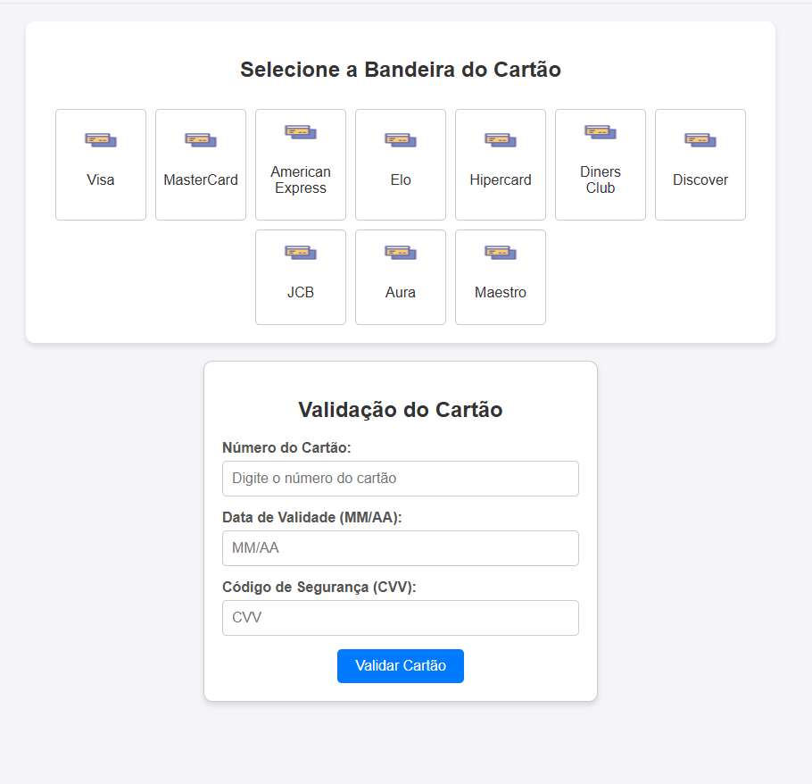

# Validador de Cartão de Crédito

Este é um projeto simples de validação de cartões de crédito desenvolvido em HTML, CSS e JavaScript. Ele permite que o usuário selecione a bandeira do cartão, insira o número do cartão, a data de validade e o código de segurança (CVV) para verificar se as informações fornecidas são válidas.

## Funcionalidades

- **Seleção de Bandeira do Cartão**: O usuário pode selecionar entre 10 bandeiras de cartão, como Visa, MasterCard, American Express, entre outras.
- **Validação do Número do Cartão**: O número do cartão é validado com base no prefixo, comprimento e no algoritmo de Luhn.
- **Validação da Data de Validade**: Verifica se a data de validade está no formato correto (MM/AA) e se não está expirada.
- **Validação do CVV**: Verifica se o código de segurança (CVV) possui 3 ou 4 dígitos.
- **Mensagens de Validação**: Exibe mensagens em um contêiner colorido (verde para válido e vermelho para inválido).

## Tecnologias Utilizadas

- **HTML**: Estrutura da página.
- **CSS**: Estilização da interface, incluindo responsividade e efeitos visuais.
- **JavaScript**: Lógica de validação e interatividade.

## Como Funciona

1. O usuário seleciona a bandeira do cartão clicando em uma das opções disponíveis.
2. Insere o número do cartão, a data de validade e o CVV nos campos apropriados.
3. Clica no botão "Validar Cartão".
4. O sistema verifica:
   - Se a bandeira do cartão foi selecionada.
   - Se o número do cartão é válido com base nas regras específicas da bandeira e no algoritmo de Luhn.
   - Se a data de validade está no formato correto e não está expirada.
   - Se o CVV possui o número correto de dígitos.
5. Exibe uma mensagem indicando se o cartão é válido ou inválido.

## Estrutura do Projeto

- **`index.html`**: Contém a estrutura da página e o código JavaScript embutido.
- **Estilos CSS**: Incluídos diretamente no arquivo HTML para estilização da página.
- **Funções JavaScript**:
  - `selectCardFlag(flag)`: Armazena a bandeira selecionada e aplica um efeito visual.
  - `validateCard()`: Realiza todas as validações do cartão.
  - `validateCardNumber(cardNumber, cardFlag)`: Valida o número do cartão com base nas regras da bandeira.
  - `isValidLuhn(cardNumber)`: Implementa o algoritmo de Luhn.
  - `validateExpirationDate(date)`: Valida a data de validade.

## Como Executar

1. Faça o download ou clone este repositório.
2. Abra o arquivo `index.html` em qualquer navegador moderno.
3. Utilize a interface para validar os dados do cartão.

## Regras de Validação

### Bandeiras Suportadas

| Bandeira       | Prefixos                  | Comprimento |
|----------------|---------------------------|-------------|
| Visa           | Começa com `4`           | 13, 16, 19  |
| MasterCard     | `51–55`, `2221–2720`     | 16          |
| American Express (Amex) | `34`, `37`      | 15          |
| Elo            | `4011`, `4389`, `4576`, etc. | 16      |
| Hipercard      | `3841`, `60`, `6062`, etc. | 13, 16, 19 |
| Diners Club     | `300–305`, `36`, `38`, etc. | 14      |
| Discover       | `6011`, `622126–622925`, etc. | 16, 19 |
| JCB            | `3528–3589`              | 16, 19      |
| Aura           | Começa com `50`          | 16          |
| Maestro        | `5018`, `5020`, `5038`, etc. | 12–19   |

### Algoritmo de Luhn

1. Comece da direita para a esquerda.
2. Dobre os dígitos em posição par.
3. Se o dobro for maior que 9, subtraia 9.
4. Some todos os dígitos.
5. O total deve ser múltiplo de 10.

## Captura de Tela

## Autor

Desenvolvido por [Michel Braga](https://github.com/mbraga2023) + Github Copilot.

## Licença

Este projeto está licenciado sob a [MIT License](LICENSE).